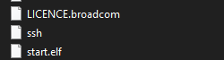
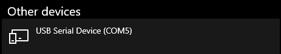
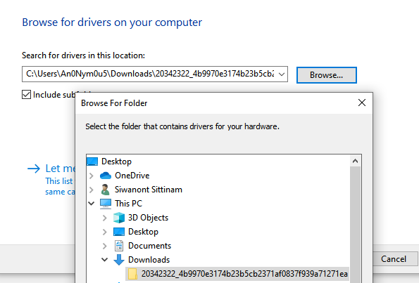
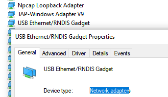

# Enable SSH over USB via Etheret Gadget Adapter

## Instruction
1. Create a new micro SD card using the **Raspberry Pi Imager**
    - You may have to eject the card and re-insert it to mount the boot partition
2. Run this command to enable Wlan Network and SSH
    - add to **config.txt**

        ```
        # Enable ethernet gadget
        dtoverlay=dwc2
        ```

    - add to **cmdline.txt**

        ```
        rootwait modules-load=dwc2,g_ether quiet ...
        ```

    - add empty file as name **ssh**

        

3. Eject the card and insert into Raspberry Pi Zero
4. Plug the *USB* port into your computer.
5. Plug a power adapter into the *POWER* port on the Raspberry Pi Zero
6. Wait for the device to boot up. The first boot is the slowest as it unpacks the fresh O/S
7. You should see `USB Ethernet/RNDIS Gadget` in the *Device Manager* control panel

    

    - If You can't see **USB Ethernet/RNDIS Gadget** Need to update **Serial Port (COM5)** Driver

        [Ethernet Gadget Driver.cab](Files/ethernet-gadget-driver.cab)

        Device Manager → Right Click at COM 5 → Click Update Driver → Choose Extract Cab folder

        

        Click Next → Wait until completed update

        You will see **USB Ethernet/RNDIS Gadget** appear

        
