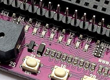
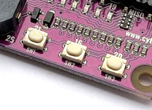
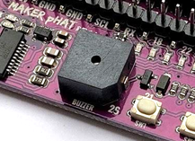
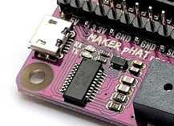
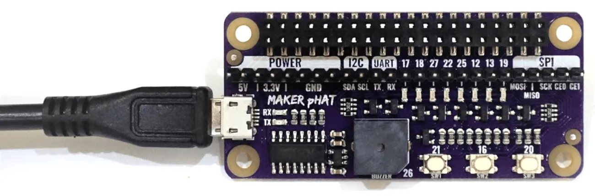
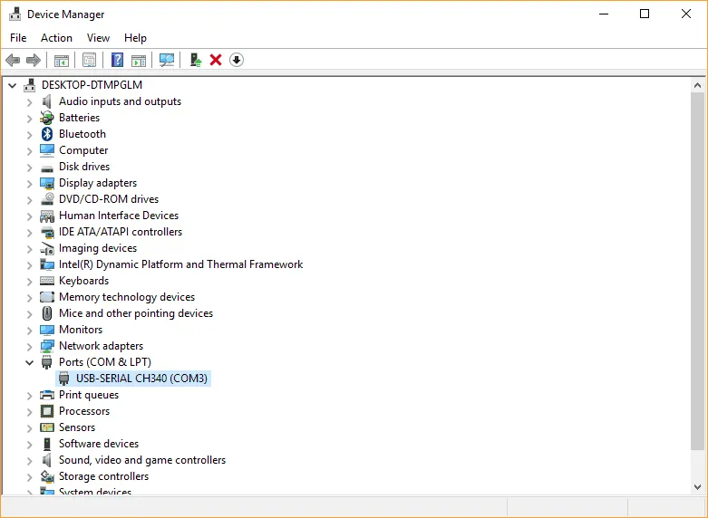

# Maker pHAT

[Reference From Cytron](https://th.cytron.io/p-maker-phat-simplifying-raspberry-pi-for-education?r=1)

## Pinout

- LEDs at Selected GPIO Pins

    

    8 LEDs is connected to GPIO 17, 18, 27, 22, 25, 12, 13 and 19. Those LED can be controlled as an output or can be act as an input (signal monitoring). In other words, GPIO that connected to the LED, can be configured as output, input and input pull up.

- Programmable Push Buttons

    

    3 units of programmable push button are included in the Maker pHAT. To utilize it, user need to configure push button GPIO as input pullup.

    - SW1 is connected to GPIO 21
    - SW2 is connected to GPIO 16
    - SW3 is connected to GPIO 20
- On-board Active Buzzer

    

    Maker pHAT also comes with on-board active buzzer. It is standard output digital device connected to GPIO 26. To activate it, set GPIO to high, and to mute it, just set GPIO to low.

- USB to Serial for Serial Remote

    

    Serial remote is a helpful tool to get started with Raspberry Pi. Luckily, Maker pHAT comes with USB to Serial module for this purpose. It is connected to Raspberry Pi’s UART pin (RX and TX). Please refer to Getting Started section for more detail.

## Install CH340 USB to Serial Driver

**Baud Rate** : 115200

- **Windows 10**

    Download and Install this [Official Link](https://cdn.cytron.io/makeruno/CH341SER.EXE) or [CH341SER_Windows.rar](CH341SER_Windows.rar)

    

- **MacOS**

    Download and Install this [Official Link](https://cdn.cytron.io/makeruno/CH341SER_MAC.ZIP) or [CH341SER_Mac.zip](CH341SER_Mac.zip)
