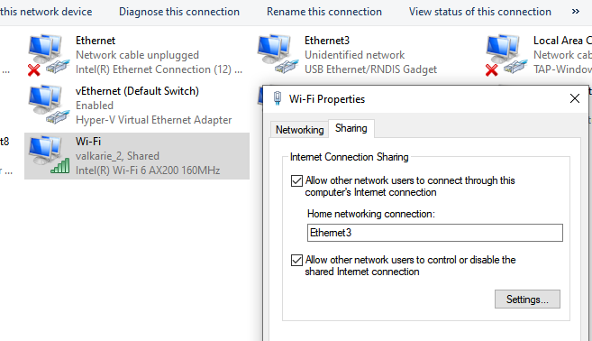
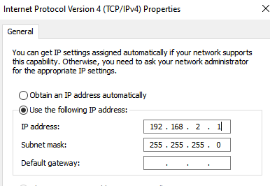

# Enable network over USB

1. Right-click the network adapter with an Internet connection (Ethernet or wireless network adapter), then select **Properties**.
2. Click **Sharing**.
3. Put a check mark on **Allow other network users to connect through this computer’s Internet connection**.
4. From the **Home networking connection** drop-down menu, select the RPI Interface.

    

5. Click **Networking**.
6. Select **IPV4**

    

7. Click **OK** to finish.
8. SSH over usb and Config USB0 Interface

    Add **/etc/network/interfaces**

    ```bash
    # interfaces(5) file used by ifup(8) and ifdown(8)
     
    # Please note that this file is written to be used with dhcpcd
    # For static IP, consult /etc/dhcpcd.conf and 'man dhcpcd.conf'
     
    # Include files from /etc/network/interfaces.d:
    source-directory /etc/network/interfaces.d
     
    auto lo
    iface lo inet loopback

    auto wlan0
    allow-hotplug wlan0
    iface wlan0 inet dhcp
     
    auto usb0
    allow-hotplug usb0
    iface usb0 inet dhcp
    ```

    ```bash
    sudo ifconfig usb0 up
    ```

    ```bash
    sudo ip link set usb0 up
    sudo dhclient usb0
    ```
